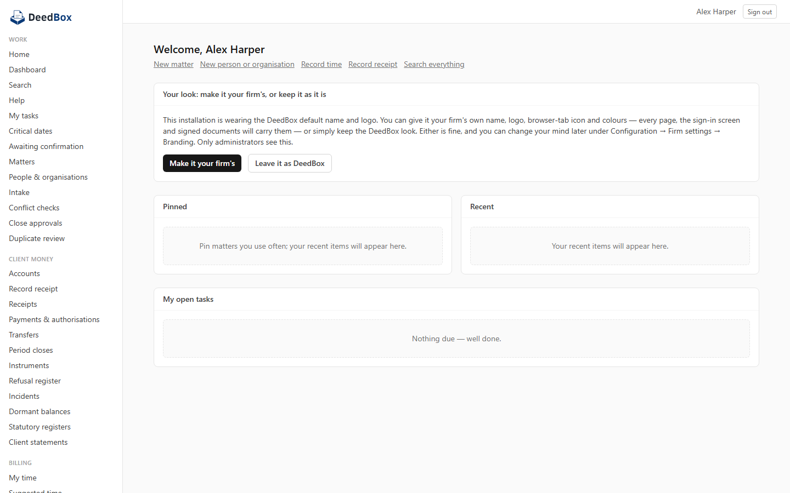
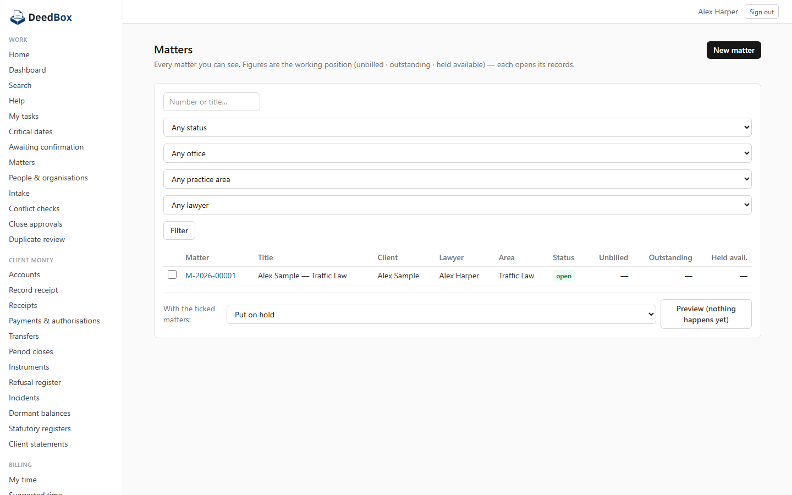
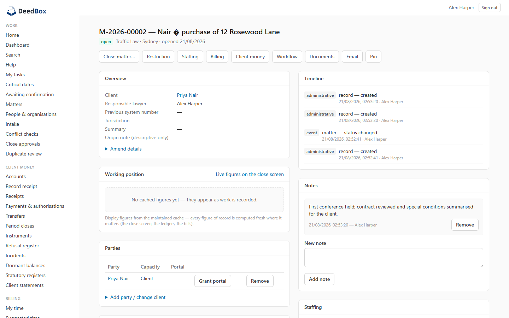
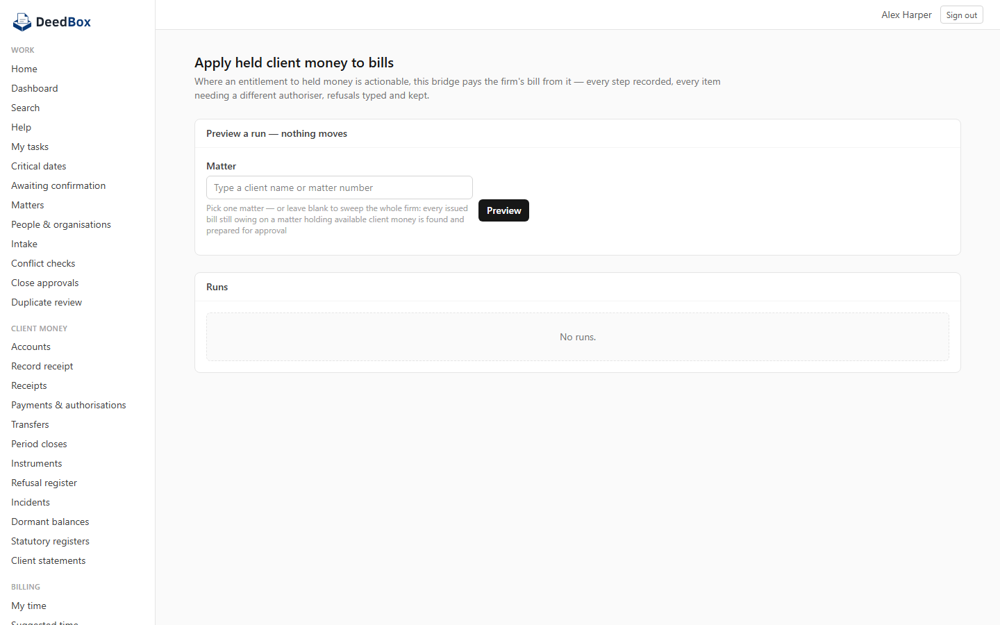

# DeedBox

Free, open-source and complete practice management system for law firms: matters and conflicts, time and billing, trust accounting, documents with e-signature and a client portal, workflows and key dates, reporting, email filing, and migration from your previous system. Self-hosted — your practice, your data, on your own systems.

## What it is

- **Matters and parties** — matters, parties, relationships, conflict checking,
  duplicate detection, restricted matters with per-person visibility.
- **Time and billing** — time capture, rates, estimates and budgets, draft
  bills, approval, issue, credit notes, write-offs, disputes, interest,
  reminders and instalment arrangements, statements.
- **Client money** — client and trust ledgers, receipts, payments, transfers,
  earmarks, instruments and dishonours, bank reconciliation with certification,
  and examiner access. Period close obligations, dormancy handling and
  statutory registers are built in but pack-activated: they run to whatever
  your country pack declares, and stay quiet where it declares nothing.
- **Workflow** — matter templates, stages, tasks, key dates and anchors.
- **Documents** — versions, templates, text extraction and search, sharing,
  electronic signature, a client portal, e-mail filing, office accounting.
- **Data import** — clients, matters, time, bills and disbursements from a
  spreadsheet workbook, in a validate-first pass that leaves no residue.

## What it looks like

A fresh installation, wearing the default look (every firm can carry its own
name and logo — Configuration, Firm settings, Branding):

| | |
|---|---|
|  |  |
|  |  |

## How it is built

Postgres does the enforcing. Money can never go below zero at the line that
guards it; evidence tables are append-only; every operation writes its own entry
in a hash-chained register; a refusal is recorded even though the refusing
transaction is rolled back. The running application connects as a role that
holds only the privileges each migration grants it, so append-only stores stay
append-only even against application bugs.

- `schema/changes/` — numbered, append-only migration files, applied in order.
- `schema/tests/` — one test file per migration; every invariant lands here and
  blocks release. A migration without its tests does not merge.
- `lib/ops/` — one function per operation. All database access goes through a
  single transaction wrapper that sets the acting identity for that transaction
  and nothing wider.
- `lib/reads/` — read functions for screens, governed by row security.
- `app/` — server-rendered screens (Next.js). No business rule lives in a
  screen.

## Country packs — read this before your first bill

The engine ships **jurisdiction-neutral**: no tax rule, no bank-account
shape, no statutory wording is baked in. A **country pack** supplies those as
typed declarations against the engine's rule points; the firm's database
holds the pack, and the engine consults the firm's **active** version,
falling back to a neutral default wherever the pack is silent.

- `packs/au/` is the Australian pack (GST, BSB-shaped bank identifiers, the
  statutory document wording). Its README covers installing (run the pack
  files in order) and **activating** — a separate, registered act inside the
  product (Settings → Country pack) or via `deedbox.activate_pack(...)`.
- **Until a pack version is active, bills compute no tax at all** and
  documents carry neutral wording. If your firm charges tax, install and
  activate your pack before issuing anything.
- Some catalogued rule points are reserved for future evaluators; a pack may
  declare against them without effect yet. The pack console (Settings →
  Country pack) lists every point.

## Scheduled work — the jobs are inert until something calls them

The application ships twenty-four background jobs — outbound mail dispatch,
document text extraction, session timeouts, interest proposals, dormancy
detection, register hash-chain verification and more — behind
`POST /api/jobs/<job>` guarded by the `DEEDBOX_JOB_SECRET` header. **Nothing
inside the application schedules them.** A fresh installation that skips this
section will look fine and silently never send an email.

- On PostgreSQL with `pg_cron` + `pg_net` + Vault (Supabase's stack), run the
  reference installer: `tools/install-scheduler.sql` (usage in its header).
  It schedules eighteen jobs at proven cadences.
- Anywhere else, any scheduler works — the door is plain HTTPS
  (`curl -X POST -H "x-job-secret: …" …/api/jobs/outbound-dispatch`); the
  cadence table in the installer is the reference.
- Four jobs **write to clients** (payment reminders and instalment
  notifications) and are deliberately not scheduled by default; two more
  need the Microsoft 365 seam bound first. The installer's header names them.

## Requirements

- PostgreSQL, with the `btree_gist`, `fuzzystrmatch`, `pg_trgm` and `unaccent`
  extensions available. The schema installs them into an `extensions` schema.
  It is developed and tested against Supabase's PostgreSQL.
- For scheduled work on the reference path: `pg_cron`, `pg_net` and the Vault
  extension (see "Scheduled work" above; any external scheduler is an
  alternative).
- Node.js 20 or later.

## Running the tests

```
npm install
npm test
```

The suite runs against a real PostgreSQL database — point
`DEEDBOX_DATABASE_URL` at a throwaway one. `tools/validate-chain.py` applies
every migration in order and runs each migration's own test file;
`tools/validate-app.py` applies the chain and then runs the application suite
against it.

⚠️ Those two tools each **create and destroy a real, billable Supabase
project**. They need `SUPABASE_MANAGEMENT_PAT` (or an env file named by
`DEEDBOX_SECRETS_FILE`), and `DEEDBOX_SUPABASE_ORG` unless your account has
exactly one organisation. `DEEDBOX_SUPABASE_REGION` defaults to
`ap-southeast-2`.
## Running it in production

The application is a Next.js server; run it anywhere Node.js runs (a `next
build` + `next start`, or any host that builds Next.js projects). The
database is PostgreSQL with the schema chain applied (below). Configuration
is environment variables only — the server prints one honest line per
integration at boot saying what is bound and what is not, and every unbound
integration refuses with a typed message rather than misbehaving.

**Core (required):**

| Variable | What it is |
|---|---|
| `DEEDBOX_DATABASE_URL` | The PostgreSQL connection string the app runs on. **Use a transaction-mode pooler where one is offered** — the engine is designed for it (every per-request setting is transaction-scoped), and a session-mode pooler's small client ceiling will exhaust under a busy page's parallel reads and serve errors. `DEEDBOX_DATABASE_SSL=disable` for a local database; `DEEDBOX_POOL_MAX` caps the pool (default 10). |
| `DEEDBOX_COOKIE_SECRET` | Signs the session cookie. Any long random string; changing it signs everyone out. |
| `DEEDBOX_PLATFORM_URL` + `DEEDBOX_PLATFORM_ANON_KEY` | The hosted sign-in service (a Supabase project's URL and anon key). Without them nobody can sign in — the app refuses honestly. |
| `DEEDBOX_PLATFORM_SERVICE_KEY` (+ optional `DEEDBOX_DOCUMENT_BUCKET`) | The document byte store on the same service's object storage. Without it, byte-carrying operations (uploads, template generation) refuse typed. |

**Integrations (each optional; absent = its features refuse honestly):**

| Variable(s) | Opens |
|---|---|
| `RESEND_API_KEY` + `DEEDBOX_MAIL_FROM` | Outbound email (the queue dispatches through it). |
| `DEEDBOX_GOTENBERG_URL` / `_USER` / `_PASS` | The HTML-to-PDF converter — bill emails, receipts, requisition downloads. A message that promises a document is never sent without it. |
| `DEEDBOX_JOB_SECRET` | The scheduled-work door (`POST /api/jobs/<job>` — see "Scheduled work" above). |
| `DEEDBOX_ASSISTANT_API_KEY` (+ `DEEDBOX_ASSISTANT_MODEL`) | The help assistant's model. Help articles work without it. |
| `M365_CLIENT_ID` / `_CLIENT_SECRET` / `_TENANT_ID` / `_REDIRECT_URI` | Microsoft 365 (send mail from matters, inbox filing). |
| `DEEDBOX_DAV_SECRET` + `DEEDBOX_APP_ORIGIN` | Opening documents directly in Word: the secret signs the edit tokens, and the origin is the absolute address Word dials back to. |

`DEEDBOX_DEV_SIGNIN` is a development convenience only — never set it in
production.

**The database role grant.** The schema runs everything as the `deedbox_app`
role (created by the chain). After applying the chain, the login role in
`DEEDBOX_DATABASE_URL` must be allowed to assume it:

```sql
grant deedbox_app to <your login role>;
```

## First run

The chain creates every table, role and shipped catalogue — but deliberately
no firm: a fresh database has nobody in it, and the app refuses to run
without exactly one firm. Create the foundation rows yourself (once, as the
database owner), then the sign-in account:

1. Apply the chain: run each file in `schema/changes/` in order (each has a
   paired proof in `schema/tests/`).
2. Grant the app role (above).
3. Create the foundation — one firm, one office, one administrator, one
   practice area. The administrator's **login must be the email address they
   will sign in with**:

```sql
insert into deedbox.country_pack (code, name) values ('au', 'Australia');
insert into deedbox.firm (name, operating_currency, timezone, country_pack)
  select 'Your Firm Name', 'AUD', 'Australia/Sydney', id
    from deedbox.country_pack where code = 'au';
insert into deedbox.office (name, code) values ('Main office', 'MAIN');
insert into deedbox.staff_member (person_name, login, role, office, email)
  select '{"display":"Your Name"}', 'you@example.com', r.id, o.id, 'you@example.com'
    from deedbox.role r, deedbox.office o
   where r.system_key = 'administrator' and o.code = 'MAIN';
insert into deedbox.practice_area (name) values ('General');
```

   (Use your own country/currency/timezone; the pack row is the firm's
   country binding — see "Country packs" above for installing and activating
   a pack's rules.)
4. Create the sign-in account: in the sign-in service (the Supabase project
   from `DEEDBOX_PLATFORM_URL`), create an auth user with **that same email**
   and a password. Sign in; step-up verification is a password re-entry.
5. Optional: install the scheduler (`tools/install-scheduler.sql`) so the
   background jobs run — see "Scheduled work" above.

From there, everything else is configured inside the product: Settings for
staff, roles, keys and numbering; Configure for the firm's own facts.
